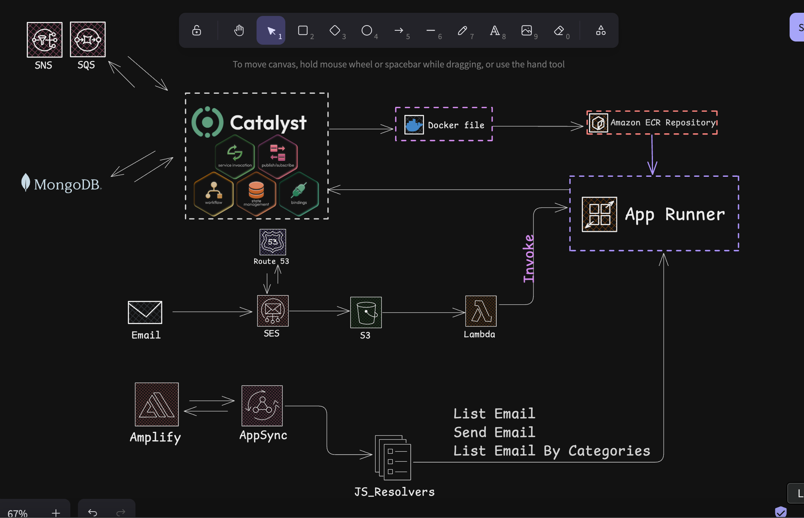

 # Dapr AI Hackathon - Project Submission Template

Welcome to the official project submission repository template for the **Dapr AI Hackathon x Diagrid**! This GitHub template repository is designed to help you structure and submit your hackathon project efficiently.

## About This Template

This repository is set up as a GitHub template that you can use as a starting point for your hackathon project. By using this template, you'll:

1. Start with the recommended project structure
2. Have clear documentation guidelines
3. Ensure your submission meets all requirements
4. Make it easier for judges to evaluate your project

## About the Hackathon

The Dapr AI Hackathon (May 16 - June 27, 2025) is a global challenge to build intelligent, resilient, and scalable AI applications using the power of Dapr Workflows and Dapr Agents. Whether you're orchestrating autonomous agents, designing durable AI pipelines, or ensuring responsible AI behavior, this hackathon is your opportunity to push the boundaries of distributed intelligence. To learn more, visit: [https://github.com/diagrid-labs/dapr-ai-hackathon](https://github.com/diagrid-labs/dapr-ai-hackathon).

## Getting Started with This Template

> [!TIP]
> Feel free to adapt this structure to your project's specific needs. The most important thing is to have a clear, organized structure with adequate documentation that meets the submission criteria.

To use this template for your Dapr AI Hackathon submission:

1. **Create a new repository from this template**: Click the "Use this template" button at the top of this repository
1. **Name your new repository**: Choose a name related to your project
1. **Clone your new repository**: Clone the repository to your local machine
1. **Provide Hackathon organizer's access**: Add @kendallroden on GitHub to access your project template
1. **Update this README.md**: Replace the content in the "Project Details" section with your project information as you iterate
1. **Add your project code**: Implement your hackathon project in this repository
1. **Submit your project**: Open an issue in the [official Dapr AI Hackathon repository](https://github.com/diagrid-labs/dapr-ai-hackathon/issues/new/choose) using the Project Submission template and include a link to your private repository

## Project Details

I faced a ton of issues, which are highlighted in this discord thread https://discord.com/channels/1255285156739285114/1383062057045458985


### 🚀 Project Name

Envoyer: An AI Email Ops Client for AWS SES Customers

### 📝 Summary

I work with teams who send/receive a high volume of emails via AWS Simple Email Service (SES). They all share the same pain: inbox chaos translates directly into missed leads, slower support, and lost revenue. 

While AWS SES is exceptionally reliable and cost-effective for sending and receiving, the last mile—triaging, understanding, and acting on messages—still depends on humans reading every thread.

I built an AI Email Ops Agent that sits next to SES to summarize, classify, prioritize, and propose actions (reply templates, routing, or escalation) the moment an email lands, so teams can move from “read and react” to “route and resolve.”

### 🏆 Category

Choose one of the following solution categories:

- Collaborative Intelligence
- Workflow Resilience
- Distributed Architecture
- Responsible AI

### 💻 Technology Used

- **Platform**: [Catalyst]
- **Dapr APIs**: [Workflow API, Pub/Sub, State,)]
- **Programming Languages**: [Python, Typescript]
- **Additional Technologies**: [AWS CDK, AWS Lambda, AWS S3, AWS SES]

### 📋 Project Features

- Invoke an agentic workflow for each email received through AWS SES

- Summarize the email in 1–3 sentences (who/what/when/urgency).

- Classify into business categories (Sales, Support, Billing, Marketing/Promos, Spam, Other).

- Extract critical entities (dates, amounts, contacts, order IDs, SLAs, sentiment).

- Prioritize (P0–P3) using rules + signals (VIP sender, negative sentiment, due date).


### 🏗️ Architecture



The application starts when an email is sent to this SES Inbound Email Address(`rosius@846agents.com`).

AWS SES saves the email in an S3 bucket. S3 triggers a lambda function. This lambda function grabs the email, 
extracts it's content and sends a message into an SQS queue through the Catalyst endpoint hosted in AWS Apprunner.

A subscribed service receives the event, summarizes, classifies.... and saves the information into a mongodb table.

We also have an aws appsync endpoint to help us retrieve emails from mongodb and also send emails.

### 🎬 Demo

https://youtu.be/xAlz16Oa1gE

## Installation & Deployment Instructions

### Prerequisites
- AWS CLI
- AWS Credentials
- AWS CDK CLI
- Docker
- Python 3.11.6
- Create and Setup a domain DKIM(https://docs.aws.amazon.com/ses/latest/dg/creating-identities.html#verify-domain-procedure)

### Additional Set-Up
#### Step 1
Update the OpenAI Key and run the application like a catalyst app. 

Push the catalyst application to AWS ECR and then AppRunner.

Navigate to the `email_cdk_app` inside the `email_cdk_app-stack.ts` file, replace the domain name with 
your verified domain name from AWS SES

```typescript
  const hostedZone = route53.HostedZone.fromLookup(this, "Zone", {
      domainName: "REPLACE_WITH_YOUR_DOMAIN",
    });
```
#### Step 2

Navigate the the `api-contruct.ts` file and replace the endpoint with the Apprunner endpoint for the
`mail-bucket` service.
```ts
    const emailServiceAPIDatasource = this.api.addHttpDataSource(
      "MailBucketService",
      "https://xxxxxxxxxxx.us-east-1.awsapprunner.com"
    );
```

#### Step 3
Navigate to the `index.py` file in the directory `lambda/email-processor` and update the endpoint on line
89
```pycon

  logger.info("Parsed e-mail", email_metadata=out)

        url = "https://xxxxxxx.us-east-1.awsapprunner.com/publish_event"

        headers = {"Content-Type": "application/json"}
```

#### Step 4

Synthesize and deploy the application 

```bash
cdk synth
cdk bootstrap
cdk deploy


```

## Team Members

- Me

## License

No License
